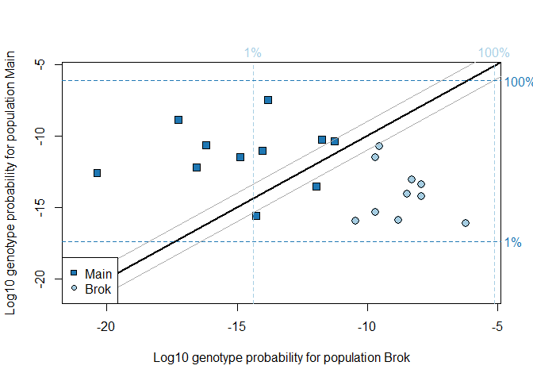
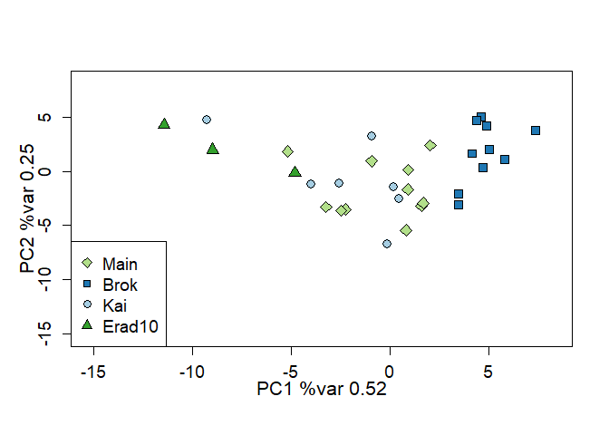
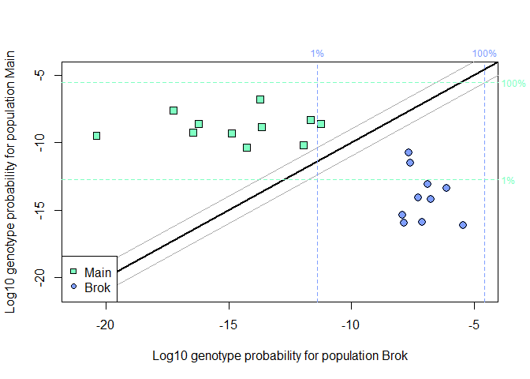

<!-- README.md is generated from README.Rmd. Please edit that file -->

# Changelog for Version 0.2.0

Changed to using Rcpp for internal saddlepoint calculations (Version
0.1.0 used all R code).

Also changed to use leave-one-out mode by default.

Other changes are cosmetic and/or internal.

# geneplot

`geneplot` is an R package for genetic assignment and analysis of
population structure. It can be used with microsatellite or SNP data.
The algorithms are related to the GENECLASS2 software package.
`geneplot` provides visualizations of the population structure and
assignment results.

`geneplot` can be used to compare the genetic patterns of different
populations, to assess the level of genetic connectedness or separation
among them. It also performs genetic assignment, comparing individuals
to populations to determine the *source population* of each individual
i.e. the population that the individual originated from.

## Installation

You can install the released version of geneplot from
[GitHub](https://github.com/lfmcmillan/geneplot) with:

``` r
# Install geneplot from GitHub
remotes::install_github("lfmcmillan/geneplot")

# Load the geneplot package
library(geneplot)
```

## Get started with **geneplot**

Read the short introductory vignette to get you started with
**geneplot**, and have a look at the simple, reproducible examples of
the `geneplot` function.

``` r
# Read the short vignette
vignette("introduction-to-geneplot")
# Reproduce a simple example
example(geneplot)
```

If you want to use Genepop-format data in `geneplot`, there’s a simple
extra step to import it, as described in the Genepop format vignette:

``` r
vignette("importing-genepop-format")
```

## Example

The following code creates a dataset in the format suitable for
GenePlot, which has columns for individual IDs and population/sample
labels, and then two columns for each locus, named in the pattern
Loc1.a1, Loc1.a2, Loc2.a1, Loc2.a2, etc. The ‘pop’ column containing the
population/sample labels must be strings rather than factors.

``` r
 ratLocnames <- c("D10Rat20","D11Mgh5","D15Rat77","D16Rat81","D18Rat96","D19Mit2","D20Rat46","D2Rat234","D5Rat83","D7Rat13")
 ratData <- rbind(
 c("Ki001","Kai",96,128,246,280,234,250,155,165,226,232,219,231,149,149,101,127,174,176,164,182),
 c("Ki002","Kai",122,126,246,276,238,238,155,165,226,232,223,231,187,187,107,121,174,174,164,164),
 c("Ki003","Kai",122,122,276,280,234,234,157,165,244,244,231,231,187,187,107,107,174,174,164,182),
 c("Ki004","Kai",130,130,276,280,238,238,157,165,0,0,223,231,187,187,101,111,168,176,184,184),
 c("Ki009","Kai",122,122,276,276,234,236,165,165,240,244,229,231,187,187,89,101,174,176,164,164),
 c("Ki010","Kai",122,122,278,280,236,236,155,165,236,244,219,231,185,187,101,101,168,174,164,164),
 c("Ki011","Kai",120,128,280,282,236,238,155,165,226,236,223,231,149,149,99,101,174,174,164,164),
 c("Bi01","Brok",96,126,280,280,236,250,165,165,232,246,231,231,185,187,89,89,170,176,154,164),
 c("Bi02","Brok",96,126,280,280,250,262,155,155,232,232,231,233,149,185,127,127,174,174,164,166),
 c("Bi03","Brok",96,126,280,280,258,262,165,165,232,232,231,231,185,187,89,127,174,174,164,164),
 c("Bi04","Brok",96,126,280,280,238,262,155,155,232,232,231,233,149,185,127,127,174,174,164,164),
 c("Bi05","Brok",96,122,280,280,250,258,155,155,226,244,231,231,187,187,107,127,174,176,164,164),
 c("Bi06","Brok",96,96,280,280,238,262,155,155,232,232,231,231,187,187,123,127,174,174,164,164),
 c("Bi11","Brok",96,96,278,280,234,250,165,165,226,240,231,231,149,187,89,99,170,170,154,164),
 c("Bi12","Brok",96,96,276,280,234,250,165,165,240,240,231,231,187,187,89,99,170,174,154,164),
 c("Bi13","Brok",96,126,276,276,246,250,165,165,226,244,231,231,149,187,99,99,174,174,164,164),
 c("Bi14","Brok",96,126,276,276,262,262,155,165,226,244,231,231,149,187,89,107,170,174,154,164),
 c("Ki092","Main",122,126,280,282,234,238,165,165,236,240,231,231,149,187,95,95,0,0,164,164),
 c("Ki093","Main",122,126,282,282,238,238,165,165,236,240,231,231,149,187,95,107,166,174,164,182),
 c("Ki094","Main",122,126,280,282,238,238,165,165,226,240,231,231,173,187,95,127,174,176,154,182),
 c("Ki095","Main",120,126,280,280,234,236,155,165,244,246,231,231,161,187,123,127,174,174,154,154),
 c("Ki097","Main",122,126,280,280,236,236,163,165,236,242,219,231,149,161,107,115,166,174,164,166),
 c("Ki098","Main",96,122,276,280,236,238,155,165,242,244,233,233,149,187,99,107,174,174,164,164),
 c("Ki100","Main",122,122,280,280,234,234,155,165,236,236,219,235,0,0,107,107,174,176,164,164),
 c("Ki101","Main",122,126,276,280,234,238,155,155,236,244,229,231,0,0,101,101,0,0,164,182),
 c("Ki102","Main",122,126,0,0,0,0,155,163,0,0,229,231,0,0,107,107,0,0,0,0),
 c("Ki103","Main",122,122,280,280,234,236,163,165,0,0,231,233,0,0,99,107,0,0,164,184),
 c("Ki104","Main",96,126,276,280,236,238,157,165,230,246,231,231,149,187,107,107,0,0,164,164),
 c("Ki105","Main",122,126,276,280,238,250,157,165,226,244,217,231,0,0,111,121,174,174,164,164),
 c("R01","Erad10",128,128,280,288,234,244,155,165,242,244,231,231,149,149,107,107,174,174,164,166),
 c("R02","Erad10",128,130,276,288,238,244,155,155,228,244,223,231,149,149,101,111,174,174,164,166),
 c("R03","Erad10",128,130,276,288,238,244,155,155,244,244,223,231,149,187,107,111,174,176,164,166))
 ratData <- as.data.frame(ratData, stringsAsFactors=FALSE)
 names(ratData) <- c("id","pop","D10Rat20.a1","D10Rat20.a2","D11Mgh5.a1","D11Mgh5.a2",
                     "D15Rat77.a1","D15Rat77.a2","D16Rat81.a1","D16Rat81.a2",
                     "D18Rat96.a1","D18Rat96.a2","D19Mit2.a1","D19Mit2.a2",
                     "D20Rat46.a1","D20Rat46.a2","D2Rat234.a1","D2Rat234.a2",
                     "D5Rat83.a1","D5Rat83.a2","D7Rat13.a1","D7Rat13.a2")
```

The populations/samples in this dataset are Kai, Main, Brok and Erad10.

This is a basic example of running GenePlot using the dataset created
above:

``` r
## Running geneplot on two populations, Brok and Main:
geneplot(ratData, c("Brok","Main"), locnames=ratLocnames)
#> Removing  1 individuals with number of loci <  6
```



    #>       id  pop   status nloc       Brok       Main   Brok.raw   Main.raw
    #> 8   Bi01 Brok complete   10 -10.463155 -15.962398 -10.463155 -15.962398
    #> 9   Bi02 Brok complete   10  -8.796691 -15.919349  -8.796691 -15.919349
    #> 10  Bi03 Brok complete   10  -6.204291 -16.107949  -6.204291 -16.107949
    #> 11  Bi04 Brok complete   10  -7.931389 -14.214627  -7.931389 -14.214627
    #> 12  Bi05 Brok complete   10  -9.527735 -10.745273  -9.527735 -10.745273
    #> 13  Bi06 Brok complete   10  -7.924364 -13.380205  -7.924364 -13.380205
    #> 14  Bi11 Brok complete   10  -9.692142 -15.363519  -9.692142 -15.363519
    #> 15  Bi12 Brok complete   10  -8.289629 -13.090892  -8.289629 -13.090892
    #> 16  Bi13 Brok complete   10  -9.679080 -11.492340  -9.679080 -11.492340
    #> 17  Bi14 Brok complete   10  -8.466085 -14.086351  -8.466085 -14.086351
    #> 19 Ki093 Main complete   10 -17.260941  -8.896318 -17.260941  -8.896318
    #> 20 Ki094 Main complete   10 -14.874779 -11.501816 -14.874779 -11.501816
    #> 21 Ki095 Main complete   10 -11.957049 -13.542455 -11.957049 -13.542455
    #> 22 Ki097 Main complete   10 -20.374850 -12.581399 -20.374850 -12.581399
    #> 23 Ki098 Main complete   10 -11.244062 -10.364003 -11.244062 -10.364003
    #> 18 Ki092 Main   impute    9 -13.825510  -7.471357 -12.899253  -7.265848
    #> 24 Ki100 Main   impute    9 -16.186408 -10.644076 -15.175800  -9.737994
    #> 25 Ki101 Main   impute    8 -16.553048 -12.197220 -14.508189 -10.235903
    #> 27 Ki103 Main   impute    7 -14.016101 -11.028628 -10.510145  -7.412479
    #> 28 Ki104 Main   impute    9 -11.743141 -10.249605 -10.885405  -9.708348
    #> 29 Ki105 Main   impute    9 -14.257180 -15.602244 -13.280560 -13.833248

    ## Running geneplot on all the populations in the dataset, and capturing the output in the results object:
    results <- geneplot(ratData, unique(ratData$pop), locnames=ratLocnames)
    #> Removing  1 individuals with number of loci <  6



The main function in the `geneplot` package is `geneplot`. This runs the
GenePlot calculations and also plots the graphs.

You can alternatively run the calculations using `calc_logprob` and then
produce the plots using `plot_logprob`. The output of `calc_logprob` is
the same as the output of GenePlot, and can then be passed into
`plot_logprob`. This can be useful if you want to run the calculations
just once, and then rerun the plot function to test different colour
combinations and display options on the same calculated results.

``` r
## Running geneplot on two populations, Brok and Main:
results <- calc_logprob(ratData, c("Brok","Main"), locnames=ratLocnames)
#> Removing  1 individuals with number of loci <  6

## Running geneplot on all the populations in the dataset:
plot_logprob(results)
```



### Genepop-format data

The vignette ‘importing-genepop-format’ describes how to import data
from a Genepop-format file into the form required by `geneplot`.

Here is a quick example of code that would import a file in Genepop
format, using 3 digits per allele and specifying the population names
using the pop_names input. After importing the Genepop-format data, the
data and the names of the loci must be passed separately into the
`geneplot` function, and the user also has to specify which populations
to use.

``` r
genepopData <- read_genepop_format(file="C:/Users/me/Documents/myfile.gen", digits_per_allele=3, pop_names=c("PopA","PopB","PopC"))
dat <- genepopData$popData
locnames <- genepopData$locnames

geneplot(dat=dat,refpopnames=c("PopA","PopB"),locnames=locnames)
```

## Citation

``` r
citation("geneplot")
#> 
#> To cite geneplot in publications use:
#> 
#>   McMillan and Fewster (2017). Visualizations for genetic assignment
#>   analyses using the saddlepoint approximation method. Biometrics,
#>   73(3), 1029--1041. URL
#>   https://onlinelibrary.wiley.com/doi/abs/10.1111/biom.12667.
#> 
#> A BibTeX entry for LaTeX users is
#> 
#>   @Article{,
#>     title = {Visualizations for genetic assignment analyses using the saddlepoint approximation method},
#>     author = {{McMillan} and L. F. and {Fewster} and R. M.},
#>     journal = {Biometrics},
#>     year = {2017},
#>     volume = {73},
#>     number = {3},
#>     pages = {1029--1041},
#>     doi = {10.1111/biom.12667},
#>     url = {https://onlinelibrary.wiley.com/doi/abs/10.1111/biom.12667},
#>     abstract = {We propose a method for visualizing genetic assignment data by characterizing the distribution of genetic profiles for each candidate source population. This method enhances the assignment method of Rannala and Mountain (1997) by calculating appropriate graph positions for individuals for which some genetic data are missing. An individual with missing data is positioned in the distributions of genetic profiles for a population according to its estimated quantile based on its available data. The quantiles of the genetic profile distribution for each population are calculated by approximating the cumulative distribution function (CDF) using the saddlepoint method, and then inverting the CDF to get the quantile function. The saddlepoint method also provides a way to visualize assignment results calculated using the leave-one-out procedure. This new method offers an advance upon assignment software such as geneclass2, which provides no visualization method, and is biologically more interpretable than the bar charts provided by the software structure. We show results from simulated data and apply the methods to microsatellite genotype data from ship rats (Rattus rattus) captured on the Great Barrier Island archipelago, New Zealand. The visualization method makes it straightforward to detect features of population structure and to judge the discriminative power of the genetic data for assigning individuals to source populations.},
#>   }
```
